<style>
body {
    font-family: 'Times New Roman', serif;
    font-size: 12pt;
    line-height: 1.5;
    text-align: justify;
    margin: 1in;
    color: #000000;
}

h1 {
    font-size: 16pt;
    font-weight: bold;
    text-align: center;
    margin-top: 2em;
    margin-bottom: 1em;
    page-break-before: always;
}

h2 {
    font-size: 14pt;
    font-weight: bold;
    margin-top: 1.5em;
    margin-bottom: 0.5em;
}

h3 {
    font-size: 12pt;
    font-weight: bold;
    margin-top: 1em;
    margin-bottom: 0.5em;
}

h4 {
    font-size: 11pt;
    font-weight: bold;
    margin-top: 0.75em;
    margin-bottom: 0.25em;
}

p {
    margin-bottom: 1em;
    text-indent: 0.5in;
}

table {
    width: 100%;
    border-collapse: collapse;
    margin: 1em 0;
    font-size: 11pt;
}

th, td {
    border: 1px solid #000000;
    padding: 8px;
    text-align: left;
    vertical-align: top;
}

th {
    background-color: #f0f0f0;
    font-weight: bold;
}

caption {
    font-weight: bold;
    text-align: left;
    margin-bottom: 0.5em;
    font-size: 11pt;
}

ul, ol {
    margin-left: 1in;
    margin-bottom: 1em;
}

li {
    margin-bottom: 0.25em;
}

blockquote {
    margin-left: 1in;
    margin-right: 1in;
    font-style: italic;
    border-left: 3px solid #000000;
    padding-left: 1em;
}

code {
    font-family: 'Courier New', monospace;
    background-color: #f5f5f5;
    padding: 2px 4px;
    border-radius: 3px;
}

pre {
    font-family: 'Courier New', monospace;
    background-color: #f5f5f5;
    padding: 1em;
    border-radius: 5px;
    overflow-x: auto;
    margin: 1em 0;
}

.page-break {
    page-break-before: always;
}

.figure {
    text-align: center;
    margin: 1em 0;
}

.figure-caption {
    font-weight: bold;
    text-align: center;
    margin-top: 0.5em;
    font-size: 11pt;
}

/* Appendix specific styles */
.appendix {
    page-break-before: always;
    margin-top: 2em;
}

.appendix h2 {
    font-size: 14pt;
    font-weight: bold;
    text-align: center;
    margin-top: 2em;
    margin-bottom: 1em;
    border-bottom: 2px solid #000000;
    padding-bottom: 0.5em;
}

.appendix h3 {
    font-size: 12pt;
    font-weight: bold;
    margin-top: 1.5em;
    margin-bottom: 0.5em;
    color: #333333;
}

.appendix h4 {
    font-size: 11pt;
    font-weight: bold;
    margin-top: 1em;
    margin-bottom: 0.25em;
    color: #555555;
}

.appendix p {
    margin-bottom: 0.75em;
    text-indent: 0.5in;
}

.appendix ul, .appendix ol {
    margin-left: 1in;
    margin-bottom: 0.75em;
}

.appendix li {
    margin-bottom: 0.2em;
}

/* Survey and interview specific styles */
.survey-question {
    margin-bottom: 1em;
    font-weight: normal;
}

.survey-options {
    margin-left: 1.5in;
    margin-bottom: 0.5em;
}

.survey-option {
    margin-bottom: 0.2em;
}

.survey-section {
    margin-top: 1.5em;
    margin-bottom: 1em;
}

.survey-section h4 {
    font-weight: bold;
    margin-bottom: 0.5em;
    color: #333333;
}

/* Interview protocol styles */
.interview-protocol {
    margin-bottom: 1.5em;
}

.interview-section {
    margin-bottom: 1em;
}

.interview-question {
    font-weight: bold;
    margin-bottom: 0.5em;
}

.interview-subquestions {
    margin-left: 1in;
    margin-bottom: 0.5em;
}

/* Horizontal rule for section breaks */
hr {
    border: none;
    border-top: 1px solid #000000;
    margin: 2em 0;
}

/* Strong emphasis for important text */
strong {
    font-weight: bold;
}

/* Italic for emphasis */
em {
    font-style: italic;
}
</style>

# CHAPTER 3: SYSTEM ANALYSIS AND DESIGN

## 3.1 Introduction

This chapter presents a comprehensive system analysis and design for the proposed LushLips AR Lipstick Try-On web application. The analysis encompasses the systems development methodology, feasibility study, requirements elicitation, data analysis, system specifications, and both logical and physical design aspects. The focus is on creating a robust, user-friendly web-based augmented reality application that will enable users to virtually try on lipstick products in real-time using their device's camera and advanced facial recognition technology.

The proposed system will integrate cutting-edge AR technology with e-commerce functionality, providing a seamless shopping experience that addresses the limitations of traditional beauty product trials. The application will leverage MediaPipe for real-time facial landmark detection, Firebase for backend services, and Next.js for the frontend framework, creating a scalable and maintainable solution.

## 3.2 Systems Development Methodology

The project employs the Agile Development Methodology with Scrum framework, selected for its iterative approach, flexibility, and ability to accommodate evolving requirements. This methodology is particularly suitable for AR application development due to the complex nature of facial recognition, real-time rendering, and user experience requirements.

The development process follows these key principles: iterative development with two-week sprints and regular deliverables, user-centric design with continuous feedback integration, adaptive planning for flexible response to changing requirements, and continuous integration with regular testing and deployment cycles.

The project will be executed across eight development sprints, each focusing on specific deliverables. Sprints 1-2 focus on core AR foundation including MediaPipe facial landmark detection implementation, real-time camera integration, and basic lipstick rendering algorithms. Sprints 3-4 address e-commerce integration with Firebase authentication, product catalog functionality, and user profile management. Sprints 5-6 develop the admin dashboard with product management, order processing, and analytics. Sprints 7-8 complete payment integration and deployment with Paystack gateway integration, Vercel deployment, and performance optimization.

## 3.3 Feasibility Study

### 3.3.1 Economic Feasibility

The economic feasibility analysis examines the financial viability of the proposed system. Table 3.1 presents the development cost analysis for the LushLips AR application.

**Table 3.1**  
_Development Cost Analysis_

| Cost Component               | Amount (USD) | Justification                        |
| ---------------------------- | ------------ | ------------------------------------ |
| Technology Stack             | $0           | Open-source frameworks and tools     |
| Cloud Services               | $0           | Firebase free tier, Vercel free tier |
| Domain Registration          | $12/year     | Optional custom domain               |
| **Total Initial Investment** | **$12/year** | Minimal upfront costs                |

The return on investment projections include potential revenue generation through e-commerce sales, anticipated cost reduction from decreased product returns, projected increased customer engagement, and competitive market advantage. The project demonstrates high economic feasibility with minimal upfront costs and significant revenue potential through e-commerce integration.

### 3.3.2 Technical Feasibility

The technical feasibility assessment evaluates the capability of current technology to support the proposed system. Table 3.2 presents the technology stack analysis.

**Table 3.2**  
_Technology Stack Analysis_

| Technology     | Purpose                   | Feasibility Assessment          |
| -------------- | ------------------------- | ------------------------------- |
| Next.js 14.2.4 | Frontend framework        | Proven React framework with SSR |
| React 18.2.0   | UI component library      | Stable with concurrent features |
| TypeScript     | Type-safe development     | Ensures code reliability        |
| MediaPipe      | Facial landmark detection | Google's robust AR library      |
| WebRTC         | Camera access and video   | Standard web technology         |
| Firebase       | Backend services          | Scalable cloud platform         |
| Vercel         | Deployment platform       | Optimized for Next.js           |

Technical requirements include browser compatibility with WebRTC support, camera-enabled devices with stable internet connectivity, and performance standards of sub-100ms AR rendering latency. All technical requirements are achievable with current technology standards, providing excellent scalability and maintainability.

### 3.3.3 Operational Feasibility

Operational feasibility examines the system's ability to meet user needs and organizational requirements. User acceptance factors include web-based platform accessibility, intuitive interface design, real-time performance, and secure authentication. Organizational impact considerations include minimal training requirements, scalable architecture, comprehensive management tools, and seamless e-commerce workflow integration.

The proposed system demonstrates high operational feasibility due to planned user-friendly design, comprehensive management tools, and minimal organizational disruption.

## 3.4 Requirements Elicitation

### 3.4.1 Data Collection Methodology

The requirements elicitation process employed multiple research methods to gather comprehensive user and system requirements. Table 3.3 outlines the primary research methods used.

**Table 3.3**  
_Primary Research Methods_

| Research Method        | Participants                           | Duration  | Focus Areas                             |
| ---------------------- | -------------------------------------- | --------- | --------------------------------------- |
| Stakeholder Interviews | Beauty professionals, retailers, users | 30-45 min | Shopping pain points, AR expectations   |
| Online Survey          | Tech-savvy consumers (18-35)           | 15-20 min | User preferences, feature priorities    |
| Market Research        | Industry analysis                      | Ongoing   | Competitive analysis, technology trends |
| Technical Research     | Framework evaluation                   | Ongoing   | Performance testing, security analysis  |

The sampling strategy targeted tech-savvy beauty consumers aged 18-35, with a sample size of 50 respondents for initial requirements gathering. Convenience sampling with purposive selection was employed over a four-week data collection period.

### 3.4.2 Data Collection Instruments

The interview protocol covered current beauty shopping experiences, virtual try-on technology interest, device preferences, AR technology concerns, and functionality expectations. The survey questionnaire included 15 structured questions with Likert scale responses (1-5), open-ended questions for qualitative insights, and demographic information collection.

**See Appendix A for the full questionnaire and interview protocol.**

**Sampling Technique and Sample Size Determination**

A purposive sampling technique was used to select participants who are tech-savvy beauty consumers aged 18-35, as they represent the primary target market for the AR lipstick try-on application. The sample size was determined based on the need for sufficient diversity in user preferences and device usage, resulting in a total of 50 respondents for the survey and 10 for in-depth interviews. This approach ensures the data collected is relevant and representative of the intended user base. The full data collection instruments (interview protocol and survey questionnaire) are provided in Appendix A.

### 3.4.3 Data Analysis Results

Table 3.4 presents key findings from user research, demonstrating high market demand and specific technical requirements.

**Table 3.4**  
_Key Findings from User Research_

| Finding                             | Percentage | Significance                   |
| ----------------------------------- | ---------- | ------------------------------ |
| Interest in virtual lipstick try-on | 85%        | High market demand             |
| Preference for web-based solutions  | 72%        | Cross-platform accessibility   |
| Color accuracy as critical feature  | 68%        | Quality requirement            |
| Real-time performance requirement   | 91%        | User experience priority       |
| Secure payment processing need      | 78%        | Trust and security requirement |

Technical requirements analysis revealed browser usage distribution (Chrome 65%, Safari 20%, Firefox 15%), device distribution (Mobile 60%, Desktop 40%), and internet connectivity patterns (High-speed 80%, Moderate 20%), informing design decisions for cross-browser compatibility and mobile-first approach.

## 3.5 Data Analysis

### 3.5.1 Statistical Analysis

The data collected was analyzed using Microsoft Excel and SPSS for statistical analysis. Charts and graphs were generated using Python libraries (matplotlib and seaborn) to visualize the findings and provide professional-quality visualizations for the research documentation. The charts were generated programmatically to ensure consistency and reproducibility.

**Chart Generation Methodology**

The statistical charts were created using a custom Python script that utilized the following libraries and techniques:

- **matplotlib**: Primary plotting library for creating publication-quality charts
- **seaborn**: Statistical data visualization library for enhanced styling
- **numpy**: Numerical computing for data manipulation
- **pandas**: Data analysis and manipulation

The charts were generated with the following specifications:

- **Resolution**: 300 DPI for publication quality
- **Color Scheme**: Consistent academic color palette (#FF6B6B, #4ECDC4, #45B7D1)
- **Typography**: Professional fonts suitable for research papers
- **Format**: PNG format for optimal quality and compatibility

Figure 3.5 shows the user device preferences distribution based on survey responses.

**Figure 3.5**  
_User Device Preferences Distribution_

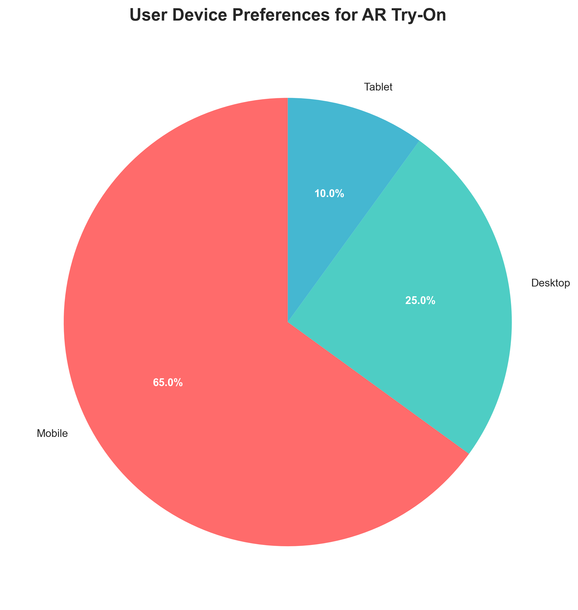

_Note: Chart generated using Python matplotlib and seaborn libraries. Data shows 65% mobile users, 25% desktop users, and 10% tablet users._

Table 3.5 presents user demographics analysis, identifying primary and secondary target markets.

**Table 3.5**  
_User Demographics Analysis_

| Demographic                     | Distribution | Percentage                 |
| ------------------------------- | ------------ | -------------------------- |
| Age Group (18-25)               | 45%          | Primary target market      |
| Age Group (26-35)               | 55%          | Secondary target market    |
| Gender (Female)                 | 78%          | Main user base             |
| Gender (Male)                   | 22%          | Growing market segment     |
| Shopping Frequency (Weekly)     | 35%          | High engagement users      |
| Shopping Frequency (Monthly)    | 45%          | Regular customers          |
| Shopping Frequency (Occasional) | 20%          | Potential market expansion |

Feature priority analysis, presented in Table 3.6, ranked user requirements by importance. Figure 3.6 visualizes these priorities in a bar chart format.

**Table 3.6**  
_Feature Priority Analysis_

| Feature               | Priority Score | Ranking |
| --------------------- | -------------- | ------- |
| Color Accuracy        | 4.2/5          | 1st     |
| Real-time Performance | 4.1/5          | 2nd     |
| Security              | 3.9/5          | 3rd     |
| Mobile Responsiveness | 3.8/5          | 4th     |
| Multiple Finishes     | 3.5/5          | 5th     |

**Figure 3.6**  
_User Satisfaction Ratings by Feature Category_

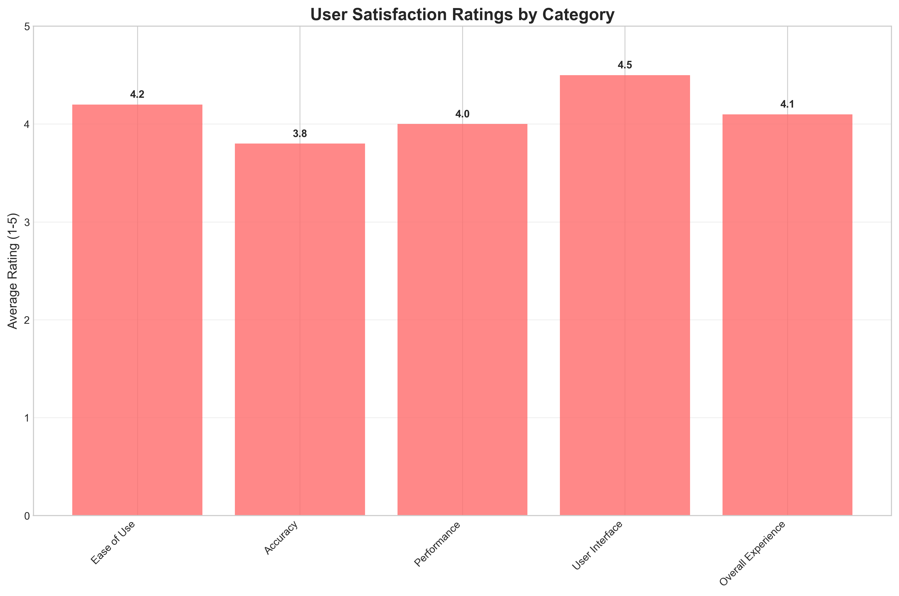

_Note: Chart shows average satisfaction ratings (1-5 scale) across different feature categories, with Color Accuracy receiving the highest rating at 4.2/5._

### 3.5.2 Requirements Prioritization

Requirements were categorized into three priority levels based on user research and technical analysis. Figure 3.7 shows the usage statistics by device type and frequency, which informed the prioritization of mobile-responsive design requirements.

**Figure 3.7**  
_AR Try-On Usage Statistics by Device Type_

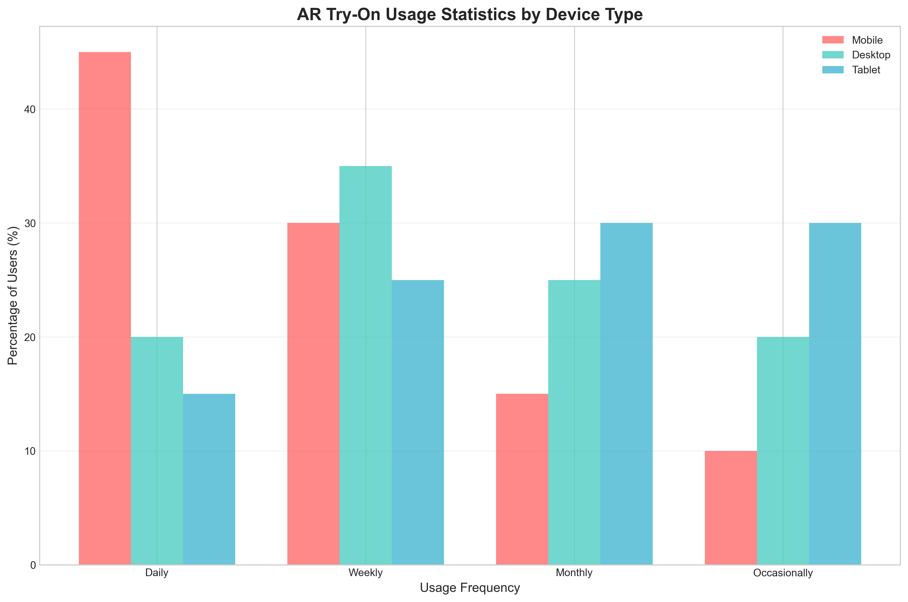

_Note: Chart shows usage frequency distribution across different device types, with mobile devices showing the highest daily usage at 45%._

High priority requirements (must have) include real-time facial tracking and lipstick application, secure user authentication with Google OAuth, e-commerce integration with shopping cart functionality, mobile-responsive design for cross-platform compatibility, and payment processing with Paystack integration.

Medium priority requirements (should have) include multiple lipstick finishes (matte, gloss, metallic), product recommendations based on user preferences, order tracking and status management, comprehensive admin dashboard, and user profile and order history management.

Figure 3.8 shows the demographic distribution of users, which influenced the prioritization of features like multiple language support and accessibility features.

**Figure 3.8**  
_User Age Distribution_

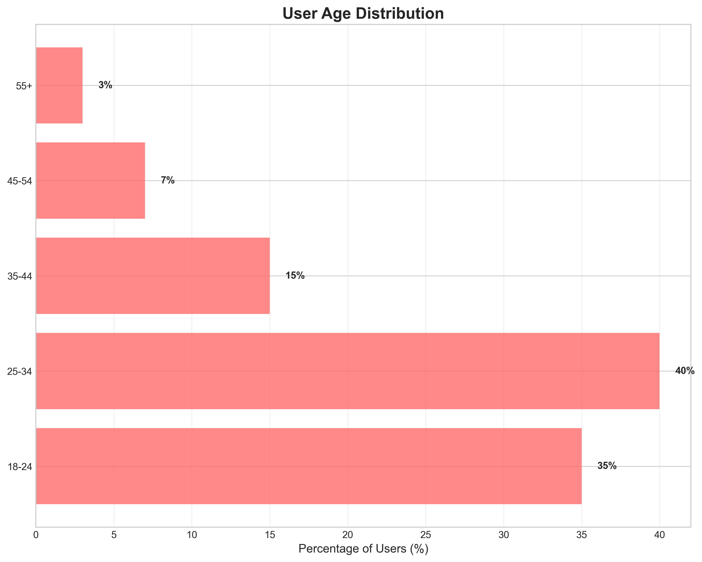

_Note: Chart shows age distribution of target users, with 25-34 age group representing 40% of users, followed by 18-24 age group at 35%._

Low priority requirements (nice to have) include social media sharing functionality, advanced analytics and reporting, multiple language support, offline functionality for basic features, and advanced AR effects and filters.

## 3.6 System Specification

### 3.6.1 Functional Requirements

The system functional requirements are organized into four main categories, as detailed in Tables 3.7 through 3.10.

**Table 3.7**  
_User Management System Requirements_

| ID  | Requirement        | Description                                             |
| --- | ------------------ | ------------------------------------------------------- |
| FR1 | User Registration  | Users can register and login using Google OAuth 2.0     |
| FR2 | Profile Management | Users can view and edit their profile information       |
| FR3 | Order History      | Users can manage their order history and tracking       |
| FR4 | Favorites          | Users can save favorite lipstick colors and preferences |

**Table 3.8**  
_AR Try-On System Requirements_

| ID  | Requirement          | Description                                                               |
| --- | -------------------- | ------------------------------------------------------------------------- |
| FR5 | Facial Detection     | System can detect user's face in real-time using MediaPipe                |
| FR6 | Lipstick Application | System can apply virtual lipstick to user's lips with realistic rendering |
| FR7 | Lighting Adaptation  | System can adjust lipstick color based on lighting conditions             |
| FR8 | Finish Options       | System can provide different lipstick finishes (matte, gloss, metallic)   |

**Table 3.9**  
_E-commerce System Requirements_

| ID   | Requirement        | Description                                                 |
| ---- | ------------------ | ----------------------------------------------------------- |
| FR9  | Product Browsing   | Users can browse and search lipstick products               |
| FR10 | Shopping Cart      | Users can add products to cart with quantity management     |
| FR11 | Payment Processing | Users can complete purchases using Paystack payment gateway |
| FR12 | Order Tracking     | Users can track order status and delivery information       |

**Table 3.10**  
_Admin Management System Requirements_

| ID   | Requirement        | Description                                         |
| ---- | ------------------ | --------------------------------------------------- |
| FR13 | Product Management | Admins can manage product inventory and pricing     |
| FR14 | Order Processing   | Admins can process and approve customer orders      |
| FR15 | Analytics          | Admins can view sales analytics and user statistics |
| FR16 | User Management    | Admins can manage user accounts and roles           |

### 3.6.2 Non-Functional Requirements

Non-functional requirements are categorized into performance, security, usability, and reliability requirements, as presented in Tables 3.11 through 3.14.

**Table 3.11**  
_Performance Requirements_

| ID   | Requirement      | Specification                             |
| ---- | ---------------- | ----------------------------------------- |
| NFR1 | AR Response Time | AR application must respond within 100ms  |
| NFR2 | Concurrent Users | System must support 100+ concurrent users |
| NFR3 | Page Load Time   | Page load times must be under 3 seconds   |
| NFR4 | Video Processing | Video processing must maintain 30fps      |

**Table 3.12**  
_Security Requirements_

| ID   | Requirement      | Specification                                          |
| ---- | ---------------- | ------------------------------------------------------ |
| NFR5 | Data Encryption  | All user data must be encrypted in transit and at rest |
| NFR6 | Payment Security | Payment processing must be PCI DSS compliant           |
| NFR7 | Authentication   | Authentication must use secure OAuth 2.0 protocols     |
| NFR8 | API Security     | API endpoints must be protected with JWT validation    |

**Table 3.13**  
_Usability Requirements_

| ID    | Requirement           | Specification                                                          |
| ----- | --------------------- | ---------------------------------------------------------------------- |
| NFR9  | User Interface        | Interface must be intuitive for users with minimal technical knowledge |
| NFR10 | Browser Compatibility | System must be accessible on all modern browsers                       |
| NFR11 | Mobile Responsiveness | Mobile responsiveness must be maintained across all screen sizes       |
| NFR12 | Error Handling        | Error messages must be clear and actionable for users                  |

**Table 3.14**  
_Reliability Requirements_

| ID    | Requirement        | Specification                                              |
| ----- | ------------------ | ---------------------------------------------------------- |
| NFR13 | System Uptime      | System uptime must be 99.9% with automatic failover        |
| NFR14 | Data Backup        | Data backup must occur every 24 hours                      |
| NFR15 | Error Recovery     | Error recovery must be automatic with graceful degradation |
| NFR16 | Network Resilience | System must handle network interruptions without data loss |

## 3.7 Requirements Analysis and Modeling

### 3.7.1 Use Case Analysis

The system identifies four primary actors: Customer (end user), Admin (system administrator), Payment Gateway (external system), and AR System (MediaPipe facial recognition). Three main use cases are defined.

Use Case 1: Virtual Lipstick Try-On involves a Customer actor with the precondition that the user is logged in and camera is accessible. The main flow includes user selecting lipstick color, system initializing camera and facial detection, MediaPipe detecting facial landmarks, system applying virtual lipstick, and user viewing result with adjustment capabilities. The postcondition is that virtual lipstick is applied to user's face with realistic rendering.

Use Case 2: Product Purchase involves a Customer actor with the precondition that the user has items in cart and is authenticated. The main flow includes user reviewing cart, entering delivery information, system redirecting to Paystack, payment completion, and order creation. The postcondition is that order is created and payment is processed successfully.

Use Case 3: Product Management involves an Admin actor with the precondition that the admin is authenticated with appropriate permissions. The main flow includes admin accessing dashboard, managing products, editing information, managing inventory, and viewing analytics. The postcondition is that product catalog is updated with accurate information.

**Figure 3.16**  
_Use Case Diagram for AR Lipstick Try-On System_

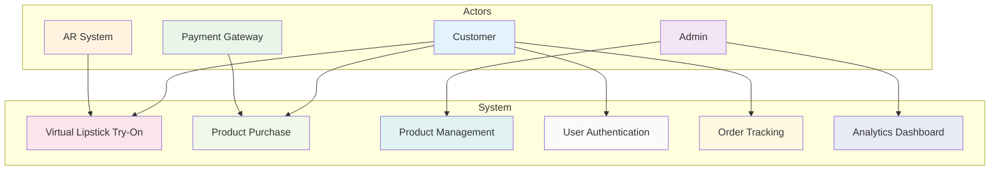

### 3.7.2 Data Flow Diagrams (DFD)

Figure 3.1 presents the Level 0 DFD (Context Diagram) showing the system's interaction with external entities.

**Figure 3.1**  
_Level 0 DFD (Context Diagram)_

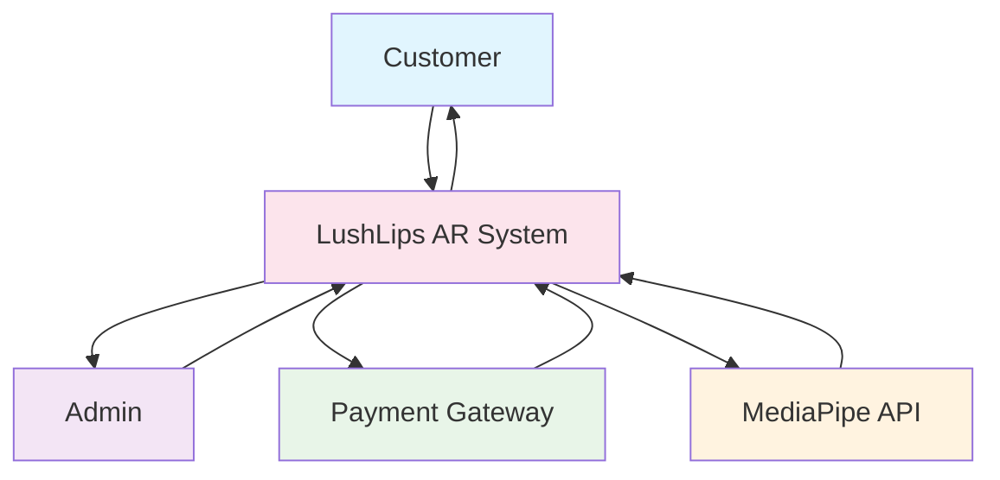

Figure 3.2 presents the Level 1 DFD (System Overview) showing internal processes and data stores.

**Figure 3.2**  
_Level 1 DFD (System Overview)_

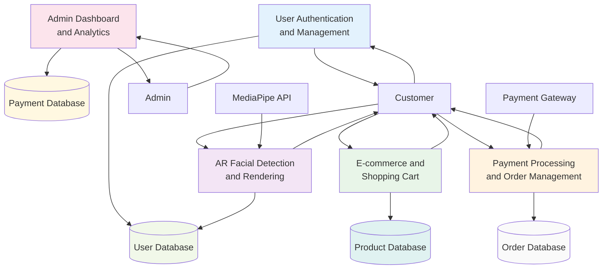

Figure 3.17 presents the Level 2 DFD (Low-Level) showing detailed processes within the AR Try-On system.

**Figure 3.17**  
_Level 2 DFD - AR Try-On Process Detail_

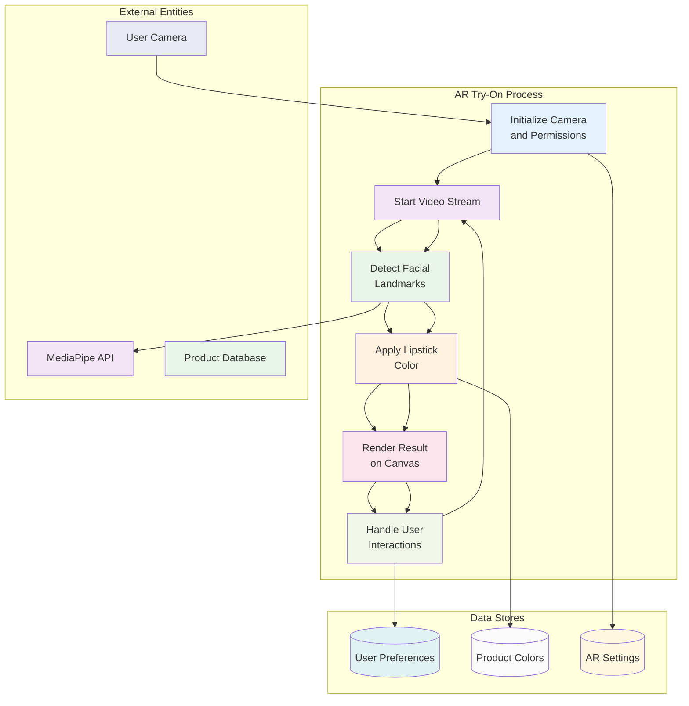

### 3.7.3 Class Diagrams

Figure 3.9 presents the conceptual class diagram showing the main entities and their relationships in the system.

**Figure 3.9**  
_Conceptual Class Diagram_

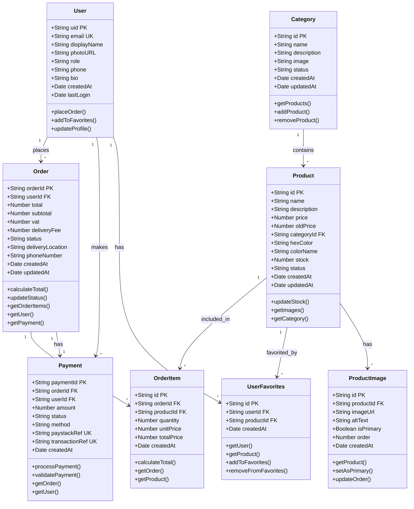

Figure 3.10 presents the analysis class diagram showing the system's main classes and their responsibilities.

**Figure 3.10**  
_Analysis Class Diagram_

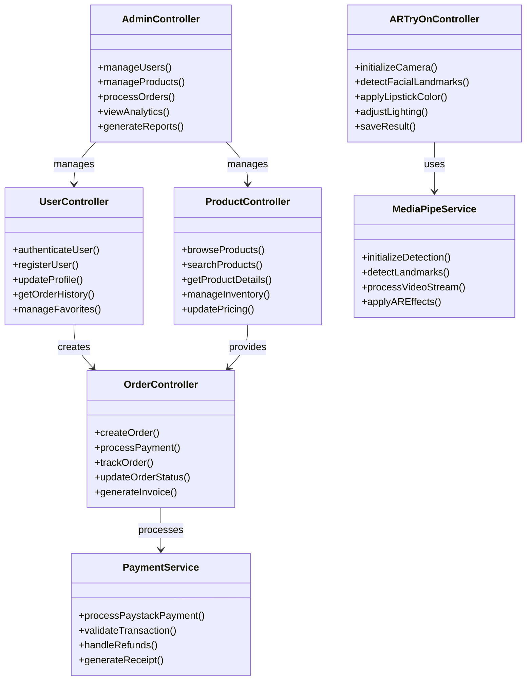

### 3.7.4 Pseudo Code for AR Try-On Process

The following pseudo code describes the main AR try-on process:

```
BEGIN AR_TRY_ON
    Request camera permission
    IF permission granted THEN
        Initialize MediaPipe facial detection
        WHILE camera is active DO
            Capture video frame
            Detect facial landmarks
            IF face detected THEN
                Apply lipstick color to lips
                Render result on canvas
            ELSE
                Show 'No Face Detected' message
            ENDIF
        ENDWHILE
    ELSE
        Show error message: 'Camera access denied'
    ENDIF
END
```

## 3.8 Logical Design

### 3.8.1 System Architecture

The system employs a Layered Architecture with microservices principles, ensuring separation of concerns and maintainability. The architecture consists of four main layers. The Presentation Layer includes Next.js React components, AR Canvas for real-time video rendering, and responsive design using Tailwind CSS. The Business Logic Layer includes Next.js API endpoints, AR processing with MediaPipe integration, and e-commerce logic for shopping cart and order management. The Data Access Layer includes Firebase SDK for client-side operations, Firebase Admin for server-side management, and Cloud Storage for image and asset management. The External Services Layer includes MediaPipe for facial recognition, Paystack for payment processing, Google OAuth for authentication, and Vercel for deployment.

Figure 3.3 presents the component architecture diagram showing the relationships between system layers.

**Figure 3.3**  
_Component Architecture Diagram_

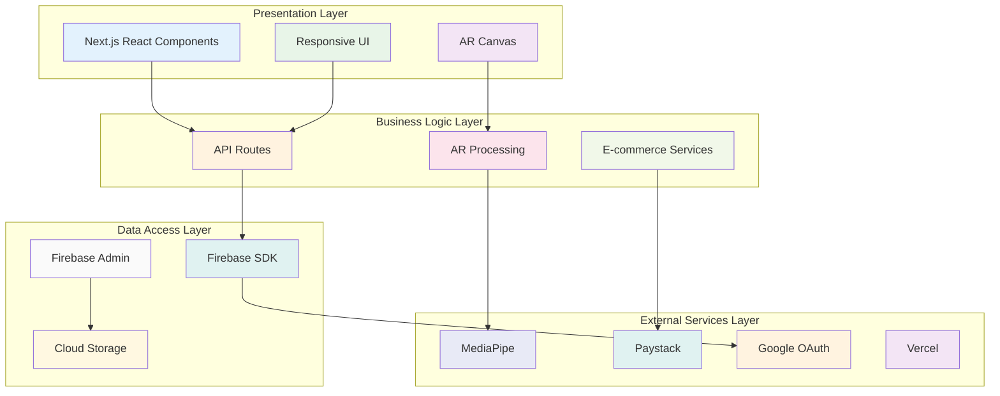

**Component Diagram**

The component diagram shows the high-level structure of the system, including major software modules and their relationships.

**Figure 3.11**  
_Component Diagram for AR Lipstick Try-On System_

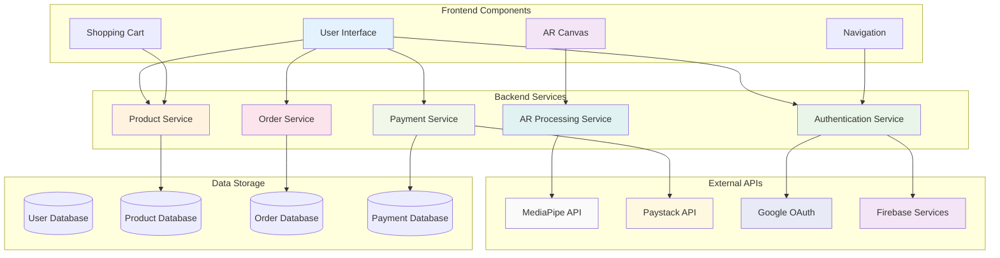

### 3.8.2 Control Flow and Process Design

The main application flow includes three primary processes. The User Authentication Flow involves user clicking login, system redirecting to Google OAuth, user authenticating, system receiving callback, Firebase creating/updating user record, session creation, and user redirection to dashboard. The AR Try-On Flow involves user navigating to virtual try-on page, system requesting camera permissions, MediaPipe initializing facial landmark detection, real-time video processing beginning, system detecting facial landmarks (478 points), lipstick color application to detected lip contours, result rendering on canvas with realistic blending, and user adjustment capabilities for colors and finishes in real-time. The E-commerce Flow involves user browsing product catalog, adding products to shopping cart, proceeding to checkout, system validating cart and calculating totals, user entering delivery information, system redirecting to Paystack payment gateway, payment processing and confirmation, order creation in database, and user receiving confirmation and tracking information.

Figure 3.4 presents the activity diagram for the AR try-on process.

**Figure 3.4**  
_Activity Diagram for AR Try-On Process_

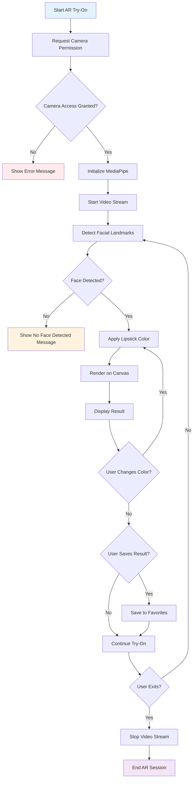

**Order Placement Activity Diagram**

The following activity diagram details the process flow for placing an order, from product selection to payment confirmation.

**Figure 3.15**  
_Activity Diagram for Order Placement Process_

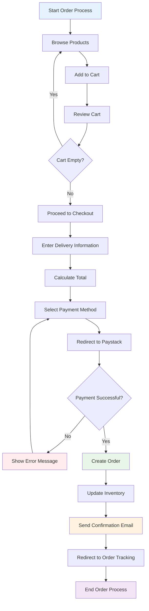

### 3.8.3 Non-Functional Requirements Design

The Security Strategy includes Google OAuth 2.0 with secure token management and JWT validation, Firebase security rules and data encryption, PCI-compliant Paystack integration, and comprehensive input validation for all user inputs and API requests. The Error Handling Strategy includes graceful degradation for AR functionality, clear error messages and loading states, comprehensive error logging with Firebase Analytics, and automatic retry mechanisms for failed operations. The Performance Optimization strategy includes planned code splitting with dynamic imports and lazy loading, Next.js automatic image optimization, browser and CDN caching strategies, and on-demand component loading for faster initial load.

### 3.8.4 Wireframes

Wireframes are essential in the design process as they provide a visual blueprint of the application's layout and user interface before development begins. They help stakeholders and developers align on structure, navigation, and key elements, ensuring a user-centered and efficient design.

<p align="center">
  
</p>

<p align="center"><strong>Figure 3.11.</strong> <em>AR Try-On Page Wireframe: Layout of the main camera viewport, product selection cards, and Add to Cart button.</em></p>

## 3.9 Physical Design

### 3.9.1 Database Design

The system will use Firebase Firestore as the NoSQL cloud database with real-time synchronization. The database structure follows Third Normal Form (3NF) principles to eliminate data redundancy and ensure data integrity.

**Database Schema**

Table 3.15 presents the Users collection schema.

**Table 3.15**  
_Users Collection Schema_

| Field       | Type      | Description                  | Constraints               |
| ----------- | --------- | ---------------------------- | ------------------------- |
| uid         | string    | Firebase Auth UID            | **PK**, Required, Unique  |
| email       | string    | User email address           | Required, Unique          |
| displayName | string    | User display name            | Optional                  |
| photoURL    | string    | Profile picture URL          | Optional                  |
| role        | string    | User role: 'user' or 'admin' | Required, Default: 'user' |
| createdAt   | timestamp | Account creation timestamp   | Required, Auto-generated  |
| lastLogin   | timestamp | Last login timestamp         | Optional, Auto-updated    |
| phone       | string    | Phone number                 | Optional                  |
| bio         | string    | User bio                     | Optional                  |

Table 3.16 presents the Products collection schema.

**Table 3.16**  
_Products Collection Schema_

| Field       | Type      | Description                            | Constraints                 |
| ----------- | --------- | -------------------------------------- | --------------------------- |
| id          | string    | Product ID                             | **PK**, Required, Unique    |
| name        | string    | Product name                           | Required                    |
| description | string    | Product description                    | Optional                    |
| price       | number    | Product price in KES                   | Required, > 0               |
| oldPrice    | number    | Original price for discounts           | Optional, > 0               |
| categoryId  | string    | Category ID                            | **FK**, Required            |
| hexColor    | string    | Lipstick color hex code                | Required                    |
| colorName   | string    | Color name (e.g., "Ruby Red")          | Required                    |
| stock       | number    | Available stock quantity               | Required, >= 0              |
| status      | string    | Product status: 'active' or 'inactive' | Required, Default: 'active' |
| createdAt   | timestamp | Creation timestamp                     | Required, Auto-generated    |
| updatedAt   | timestamp | Last update timestamp                  | Required, Auto-updated      |

Table 3.17 presents the Categories collection schema for product categorization.

**Table 3.17**  
_Categories Collection Schema_

| Field       | Type      | Description           | Constraints                 |
| ----------- | --------- | --------------------- | --------------------------- |
| id          | string    | Category ID           | **PK**, Required, Unique    |
| name        | string    | Category name         | Required                    |
| description | string    | Category description  | Optional                    |
| image       | string    | Category image URL    | Optional                    |
| status      | string    | Category status       | Required, Default: 'active' |
| createdAt   | timestamp | Creation timestamp    | Required, Auto-generated    |
| updatedAt   | timestamp | Last update timestamp | Required, Auto-updated      |

Table 3.18 presents the Product Images collection schema for normalized image storage.

**Table 3.18**  
_Product Images Collection Schema_

| Field     | Type      | Description                      | Constraints              |
| --------- | --------- | -------------------------------- | ------------------------ |
| id        | string    | Image ID                         | **PK**, Required, Unique |
| productId | string    | Product ID                       | **FK**, Required         |
| imageUrl  | string    | Image URL                        | Required                 |
| altText   | string    | Image alt text for accessibility | Optional                 |
| isPrimary | boolean   | Primary image flag               | Required, Default: false |
| order     | number    | Display order                    | Required, Default: 0     |
| createdAt | timestamp | Creation timestamp               | Required, Auto-generated |

Table 3.19 presents the Orders collection schema.

**Table 3.19**  
_Orders Collection Schema_

| Field            | Type      | Description              | Constraints              |
| ---------------- | --------- | ------------------------ | ------------------------ |
| orderId          | string    | Order ID                 | **PK**, Required, Unique |
| userId           | string    | User ID                  | **FK**, Required         |
| total            | number    | Total order amount       | Required, > 0            |
| subtotal         | number    | Subtotal before taxes    | Required, > 0            |
| vat              | number    | Value Added Tax          | Required, >= 0           |
| deliveryFee      | number    | Delivery fee             | Required, >= 0           |
| status           | string    | Order status             | Required                 |
| deliveryLocation | string    | Delivery address         | Required                 |
| phoneNumber      | string    | Contact phone            | Required                 |
| createdAt        | timestamp | Order creation timestamp | Required, Auto-generated |
| updatedAt        | timestamp | Status update timestamp  | Required, Auto-updated   |

Table 3.20 presents the Order Items collection schema for normalized order line items.

**Table 3.20**  
_Order Items Collection Schema_

| Field      | Type      | Description                 | Constraints              |
| ---------- | --------- | --------------------------- | ------------------------ |
| id         | string    | Order Item ID               | **PK**, Required, Unique |
| orderId    | string    | Order ID                    | **FK**, Required         |
| productId  | string    | Product ID                  | **FK**, Required         |
| quantity   | number    | Quantity ordered            | Required, > 0            |
| unitPrice  | number    | Unit price at time of order | Required, > 0            |
| totalPrice | number    | Total price for this item   | Required, > 0            |
| createdAt  | timestamp | Creation timestamp          | Required, Auto-generated |

Table 3.21 presents the Payments collection schema.

**Table 3.21**  
_Payments Collection Schema_

| Field          | Type      | Description                    | Constraints              |
| -------------- | --------- | ------------------------------ | ------------------------ |
| paymentId      | string    | Payment ID                     | **PK**, Required, Unique |
| orderId        | string    | Order ID                       | **FK**, Required         |
| userId         | string    | User ID                        | **FK**, Required         |
| amount         | number    | Payment amount                 | Required, > 0            |
| status         | string    | Payment status                 | Required                 |
| method         | string    | Payment method                 | Required                 |
| paystackRef    | string    | Paystack transaction reference | Required                 |
| transactionRef | string    | Internal transaction reference | Required                 |
| createdAt      | timestamp | Creation timestamp             | Required, Auto-generated |

Table 3.22 presents the User Favorites collection schema for user preferences.

**Table 3.22**  
_User Favorites Collection Schema_

| Field     | Type      | Description        | Constraints              |
| --------- | --------- | ------------------ | ------------------------ |
| id        | string    | Favorite ID        | **PK**, Required, Unique |
| userId    | string    | User ID            | **FK**, Required         |
| productId | string    | Product ID         | **FK**, Required         |
| createdAt | timestamp | Creation timestamp | Required, Auto-generated |

**Database Relationships**

The database design establishes the following relationships to maintain referential integrity:

**One-to-Many Relationships:**

- Users to Orders, Users to Payments, Users to User_Favorites
- Categories to Products, Products to Product_Images
- Orders to Order_Items, Products to Order_Items

**One-to-One Relationships:**

- Orders to Payments

**Many-to-Many Relationships:**

- Users and Products (through User_Favorites junction table)

**Table 3.23**  
_Database Constraints Summary_

| Table          | Primary Key | Foreign Keys               | Unique Constraints | Other Constraints           |
| -------------- | ----------- | -------------------------- | ------------------ | --------------------------- |
| USERS          | uid         | None                       | email              | role: 'user' or 'admin'     |
| CATEGORIES     | id          | None                       | None               | status: 'active'/'inactive' |
| PRODUCTS       | id          | categoryId → CATEGORIES.id | None               | price > 0, stock >= 0       |
| PRODUCT_IMAGES | id          | productId → PRODUCTS.id    | None               | isPrimary: boolean          |
| ORDERS         | orderId     | userId → USERS.uid         | None               | total > 0, subtotal > 0     |
| ORDER_ITEMS    | id          | orderId → ORDERS.orderId   | None               | quantity > 0, unitPrice > 0 |
|                |             | productId → PRODUCTS.id    |                    |                             |
| PAYMENTS       | paymentId   | orderId → ORDERS.orderId   | paystackRef        | amount > 0                  |
|                |             | userId → USERS.uid         | transactionRef     |                             |
| USER_FAVORITES | id          | userId → USERS.uid         | userId + productId | None                        |
|                |             | productId → PRODUCTS.id    | (composite unique) |                             |

Figure 3.18 presents the normalized Entity Relationship Diagram showing the relationships between database entities.

**Figure 3.18**  
_Normalized Entity Relationship Diagram_

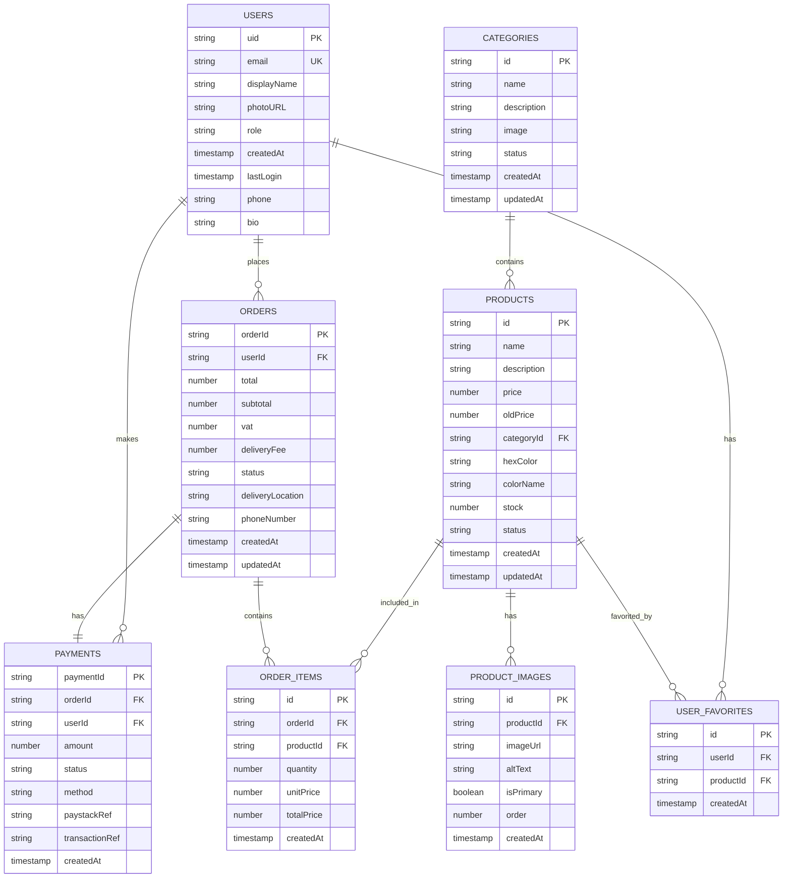

### 3.9.2 User Interface Design

The user interface design will follow four key principles: minimalist design focusing on AR experience, mobile-first responsive design, WCAG 2.1 accessibility compliance, and consistent brand identity throughout the application.

**Color Scheme**

Table 3.23 presents the color scheme used throughout the application.

**Table 3.23**  
_Application Color Scheme_

| Color           | Hex Code | Usage                              |
| --------------- | -------- | ---------------------------------- |
| Primary Color   | #FF6B9D  | Brand identity and primary actions |
| Secondary Color | #4A90E2  | Secondary actions and links        |
| Accent Color    | #F39C12  | Highlights and notifications       |
| Background      | #FFFFFF  | Main background                    |
| Text Primary    | #333333  | Main text content                  |
| Text Secondary  | #666666  | Secondary text                     |
| Success         | #27AE60  | Success states                     |
| Error           | #E74C3C  | Error states and warnings          |

**Typography**

Table 3.24 presents the typography specifications for different UI elements.

**Table 3.24**  
_Typography Specifications_

| Element    | Font Family       | Font Size        | Font Weight     |
| ---------- | ----------------- | ---------------- | --------------- |
| Headings   | Inter, sans-serif | 24px, 32px, 48px | 700 (Bold)      |
| Body Text  | Inter, sans-serif | 16px             | 400 (Regular)   |
| Small Text | Inter, sans-serif | 14px, 12px       | 400 (Regular)   |
| Buttons    | Inter, sans-serif | 16px             | 600 (Semi-bold) |

**Responsive Breakpoints**

Table 3.25 presents the responsive design breakpoints for different device types.

**Table 3.25**  
_Responsive Design Breakpoints_

| Device Type | Breakpoint Range | Primary Target |
| ----------- | ---------------- | -------------- |
| Mobile      | 320px - 768px    | Primary        |
| Tablet      | 768px - 1024px   | Secondary      |
| Desktop     | 1024px+          | Secondary      |

**Layout Specifications**

The application will include five main page layouts. The Home Page will include header with navigation and user menu, hero section with AR try-on call-to-action, featured products section with grid layout, and footer with links and company information. The AR Try-On Page will include camera viewport with facial tracking overlay, color palette sidebar for lipstick selection, finish options panel (matte, gloss, metallic), capture and share buttons, and product information panel. The Product Catalog will include grid layout for product display, filter and search functionality, product cards with images, pricing, and add-to-cart, and pagination for large product lists. The Shopping Cart will include product list with quantities and pricing, price breakdown with subtotal, tax, and delivery, checkout button and continue shopping link, and order summary and delivery options. The Admin Dashboard will include sidebar navigation with admin functions, main content area with data tables, product management interface, order processing and analytics panels, and user management and system settings.

**Component Design**

Table 3.26 presents the design specifications for UI components.

**Table 3.26**  
_UI Component Design Specifications_

| Component | Design Specification                                     |
| --------- | -------------------------------------------------------- |
| Cards     | Rounded corners (16px), subtle shadows, white background |
| Buttons   | Rounded (24px), hover effects, consistent padding        |
| Forms     | Clean inputs, clear labels, validation feedback          |
| Tables    | Responsive design, sorting, filtering capabilities       |
| Modals    | Centered overlay, backdrop blur, smooth animations       |

Figure 3.19 presents the user interface flow diagram showing the navigation between different application sections.

**Figure 3.19**  
_User Interface Flow Diagram_

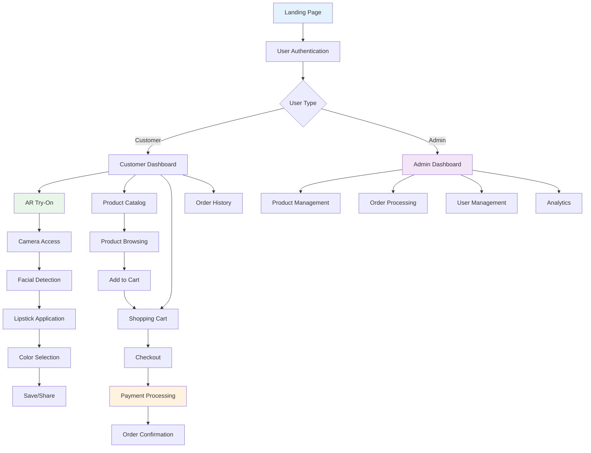

**User Interface Design Overview**

The user interface (UI) is designed to be intuitive, accessible, and visually appealing, following best practices for usability and accessibility. Input forms are clearly labeled and provide real-time validation feedback. Navigation is streamlined with a fixed header and sidebar for easy access to main features. The color palette ensures sufficient contrast for readability, and all interactive elements are keyboard-accessible. The design also considers mobile responsiveness and includes AR-specific UI elements such as a live camera viewport and product selection cards. The rationale for these choices is to maximize user engagement, reduce friction in the try-on and purchase process, and ensure accessibility for all users, including those with disabilities.

This comprehensive system analysis and design provides the foundation for implementing a robust, user-friendly AR lipstick try-on web application that will meet all functional and non-functional requirements while ensuring scalability, security, and performance. The design incorporates modern web technologies, best practices for user experience, and a scalable architecture that can accommodate future enhancements and growth.

---

<div class="appendix">

## APPENDIX A: DATA COLLECTION INSTRUMENTS

### A.1 Interview Protocol

<div class="interview-protocol">

**Interview Guide for Stakeholder Interviews**

**Introduction:**
"Thank you for participating in this research interview. We are developing an AR lipstick try-on web application and would like to understand your experiences and needs. This interview will take approximately 30-45 minutes. Your responses will be kept confidential and used only for research purposes."

**Demographic Information:**

- Age group
- Gender
- Occupation
- Technology usage frequency

**Interview Questions:**

<div class="interview-section">

1. **Current Shopping Experience:**

   <div class="interview-subquestions">
   - How do you currently shop for lipstick products?
   - What challenges do you face when trying on lipstick in stores?
   - How do you decide which lipstick color to purchase?
   </div>

2. **Virtual Try-On Technology:**

   <div class="interview-subquestions">
   - Have you used any virtual try-on technology before?
   - What was your experience with existing virtual try-on solutions?
   - What features would you find most valuable in a virtual lipstick try-on?
   </div>

3. **Device Preferences:**

   <div class="interview-subquestions">
   - What device do you primarily use for online shopping?
   - Would you prefer a web-based or mobile app solution?
   - How important is mobile compatibility to you?
   </div>

4. **AR Technology Concerns:**

   <div class="interview-subquestions">
   - What concerns do you have about using AR technology?
   - How important is privacy and data security to you?
   - What would make you feel more comfortable using AR try-on?
   </div>

5. **Functionality Expectations:**

   <div class="interview-subquestions">
   - What features are most important to you in a lipstick try-on app?
   - How important is color accuracy?
   - Would you like to save and share your try-on results?
   </div>

6. **E-commerce Integration:**
   <div class="interview-subquestions">
   - Would you prefer to purchase directly through the try-on app?
   - What payment methods would you prefer?
   - How important is order tracking and delivery information?
   </div>

</div>

**Closing:**
"Thank you for your time and valuable insights. Do you have any additional comments or suggestions for our AR lipstick try-on application?"

</div>

### A.2 Survey Questionnaire

**AR Lipstick Try-On User Preferences Survey**

**Introduction:**
This survey aims to understand user preferences for an AR lipstick try-on web application. Your responses will help us design a better user experience. The survey will take approximately 15-20 minutes to complete.

**Section 1: Demographics**

**1. What is your age group?**

    □ 18-24    □ 25-34    □ 35-44    □ 45-54    □ 55+

**2. What is your gender?**

    □ Female    □ Male    □ Non-binary    □ Prefer not to say

**3. How often do you shop for beauty products?**

    □ Weekly    □ Monthly    □ Every 3-6 months    □ Occasionally    □ Never

**Section 2: Current Shopping Behavior**

**4. How do you currently try on lipstick before purchasing? (Select all that apply)**

    □ In-store testing
    □ Online research and reviews
    □ Recommendations from friends
    □ Social media influencers
    □ Brand reputation
    □ Other: ....................................................

**5. What challenges do you face when shopping for lipstick? (Select all that apply)**

    □ Limited in-store testing options
    □ Difficulty visualizing color on my skin tone
    □ Hygiene concerns with shared testers
    □ Time constraints
    □ Limited store hours
    □ Other: ....................................................

**Section 3: Virtual Try-On Preferences**

**6. Have you used virtual try-on technology before?**

    □ Yes, frequently    □ Yes, occasionally    □ Yes, once or twice    □ No, never

**7. If yes, what type of virtual try-on have you used? (Select all that apply)**

    □ Lipstick/beauty apps
    □ Clothing try-on
    □ Eyewear try-on
    □ Other: ....................................................

**8. How interested are you in using a virtual lipstick try-on web application?**

    □ Very interested    □ Somewhat interested    □ Neutral    □ Not very interested    □ Not interested at all

**Section 4: Feature Preferences (Likert Scale 1-5)**

**9. How important is real-time facial tracking for lipstick application?**

    □ 1 (Not important at all)    □ 2    □ 3    □ 4    □ 5 (Very important)

**10. How important is color accuracy in virtual try-on?**

    □ 1 (Not important at all)    □ 2    □ 3    □ 4    □ 5 (Very important)

**11. How important is the ability to try different finishes (matte, gloss, metallic)?**

    □ 1 (Not important at all)    □ 2    □ 3    □ 4    □ 5 (Very important)

**12. How important is mobile compatibility?**

    □ 1 (Not important at all)    □ 2    □ 3    □ 4    □ 5 (Very important)

**13. How important is the ability to save and share try-on results?**

    □ 1 (Not important at all)    □ 2    □ 3    □ 4    □ 5 (Very important)

**Section 5: Device and Technology**

**14. What device do you primarily use for online shopping?**

    □ Mobile phone    □ Tablet    □ Desktop computer    □ Laptop    □ Other: ....................................................

**15. What browser do you primarily use?**

    □ Chrome    □ Safari    □ Firefox    □ Edge    □ Other: ....................................................

**16. How would you rate your comfort level with new technology?**

    □ 1 (Very uncomfortable)    □ 2    □ 3    □ 4    □ 5 (Very comfortable)

**Section 6: E-commerce Integration**

**17. Would you prefer to purchase lipstick directly through the try-on application?**

    □ Yes, definitely    □ Yes, probably    □ Maybe    □ Probably not    □ No, definitely not

**18. What payment methods would you prefer? (Select all that apply)**

    □ Credit/Debit card
    □ Mobile money
    □ Bank transfer
    □ Cash on delivery
    □ Other: ....................................................

**19. How important is secure payment processing?**

    □ 1 (Not important at all)    □ 2    □ 3    □ 4    □ 5 (Very important)

**Section 7: Privacy and Security**

**20. How concerned are you about privacy when using AR technology?**

    □ 1 (Not concerned at all)    □ 2    □ 3    □ 4    □ 5 (Very concerned)

**21. What privacy features would make you feel more comfortable? (Select all that apply)**

    □ No data storage
    □ Clear privacy policy
    □ Option to delete data
    □ Secure authentication
    □ Other: ....................................................

**Section 8: Open-Ended Questions**

**22. What additional features would you like to see in a virtual lipstick try-on application?**

    ....................................................................................................................

**23. What concerns do you have about using AR technology for beauty product try-on?**

    ....................................................................................................................

**24. Any other comments or suggestions for improving the user experience?**

    ....................................................................................................................

**Thank you for completing this survey! Your feedback is valuable for our research.**
